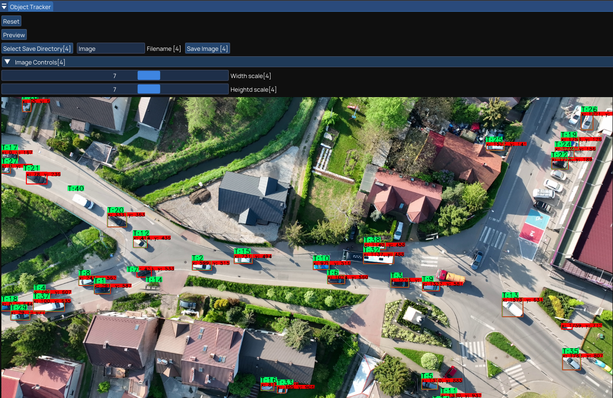
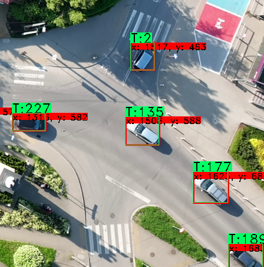
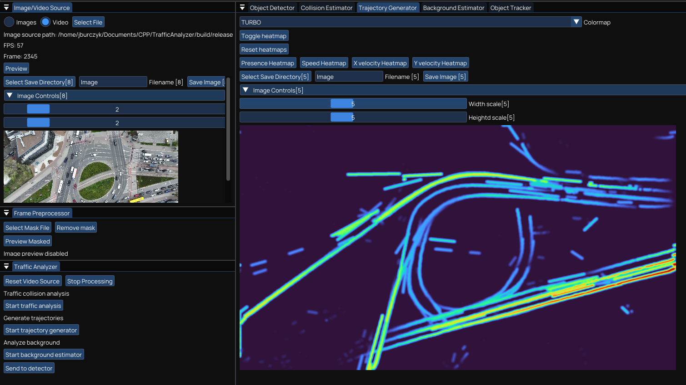
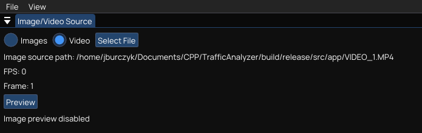
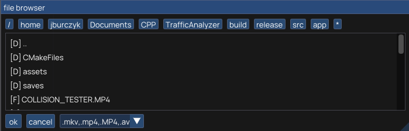
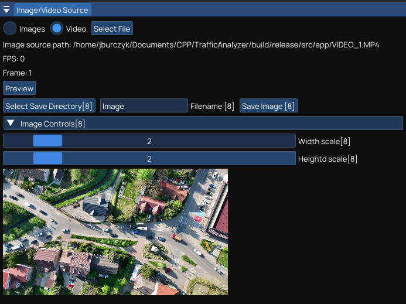
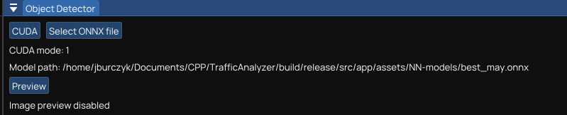
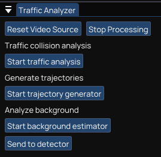
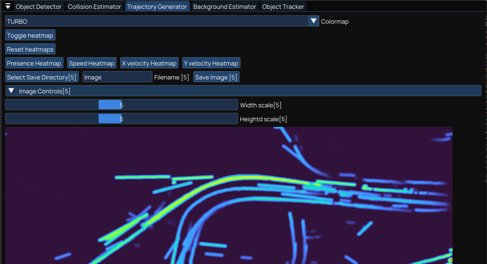

# TrafficAnalyzer - Video Analysis Application

An application written in C++ as project used for my Master's Thesis.\
Tested on **`Ubuntu 22.04`** with **`RTX 3060-Ti`**.

Main features:
* Vehicle detection via cuDNN and a YOLOv8 model
* Vehicle tracking using SORT algorithm
* Road heatmap generation
* Background estimation
* Time to collision and PET metric calculation
* Modular GUI

# Table of contents
* [Dependencies](#build-dependencies)
* [Build](#build)
* [NN Model](#neural-network-model)
* [Other tools](#other-used-tools)
* [Usage](#example-use)
    * [Input video](#input-video-file-selection)
    * [Object tracking](#object-tracking)
    * [Heatmaps](#heatmap-generation)
        * [Example heatmaps](#example-speed-heatmaps)
* [Reffereced repositories](#special-thanks-to-the-developers-of-these-projects)
#

<div align="center">

&nbsp;

<br/>


</div>
&nbsp;

## Build dependencies
* **CUDA and cuDNN**\
`CUDA version: 11.6`\
It will most likely work with newer versions, mind you will have to modify **`./CMakeLists.txt`**.\
 \
Attaching some steps (as extracted from terminal history) for installation at **`./scripts/cuda_install_help.txt`** but they may not work, you should try to get the latests drivers anyways that are supported by your Nvidia driver and hardware.

* **ffmpeg**\
`version: 4.4.2-0ubuntu0.22.04.1`

* **OpenCV**\
`version: 4.7.0`\
Built from srouce with CUDA and FFMPEG support.


## Build
The project uses [CMake](https://cmake.org) and [Ninja](https://ninja-build.org) as build systems.\
Build scripts are located in **`./scripts`** directory which can be streamlined to use via VSCode tasks.

Built with **g++** `version: 11.4`

Manual build:
```shell
cmake -GNinja -DCMAKE_BUILD_TYPE=Release -B build/release
ninja -C build/release
```
### NOTICE: Due to problems with OpenCV, CUDA and tested hardware, debug build may be unstable and not support GPU acceleration!

Run the application:

```shell
cd ./build/release/src/app && ./TrafficAnalyzer
```

## Neural Network Model
Project comes with a pretrained neural network based on YOLOv8-s architecture distributed as ONNX model.\
Model file is located at **`./src/app/assets/NN-models/YOLOv8s-VSAI.onnx`**

## Other used tools

* [YOLOv8](https://github.com/ultralytics/ultralytics) - image recognition convolutional neural network architecture distributed with python scripts for training and inference as well as examples such as C++ use.


# Example use

## Input video file selection
* On *`Image/Video Source`* tab click Select File.

<br/>
<div align="center">

</div>
<br/>

* File browser will open with video file extension filter, select file and click *`ok`*.

<br/>
<div align="center">

</div>
<br/>

* First video frame should be possible to preview on *`Image/Video Source`* tab via *`Preview`* button.

<br/>
<div align="center">

</div>

## Object tracking
* After selecting input video head over to *`Object Detector`* tab.
* Select CUDA mode (0=CPU / 1=GPU).
* Select NN model.

<br/>
<div align="center">

</div>
<br/>

* On *`Traffic Analyzer`* tab click *`Start traffic analysis`* button.

<br/>
<div align="center">

</div>
<br/>

* On *`Object Tracker`* tab click *`Preview`* button.
* Detections and trackers should be visible on the preview.

<br/>

<div align="center">

&nbsp;

</div>

## Heatmap generation

* If object tracking is running head to *`Traffic analyzer`* tab click *`Stop Processing`* button.
* On the same tab (*`Traffic Analyzer`*) click *`Start trajectory generator`* button.
* On *`Trajectory generator`* select colormap (TURBO is a good default)
* On the same tab (*`Trajectory Generator`*) click *`Toggle heatmap`* button.
* Then click on the corresponding heatmap button (e.g. *`Presence heatmap`*)

<br/>
<div align="center">

</div>
<br/>

## Example speed heatmaps
<div align="center">
<br/>
<br/>

<br/>
Speed magnitude
<br/>
<br/>

<br/>
x direction speed
<br/>
<br/>

<br/>
y direction speed
</div>

## Special thanks to the developers of these projects:

* Build system and GUI base [cpp-gui-template-sdl2](https://github.com/MartinHelmut/cpp-gui-template-sdl2)
* Imgui file browser component [imgui-filebrowser](https://github.com/AirGuanZ/imgui-filebrowser)
* Hungarian algorithm C++ implementation [hunharian-algorithm-cpp](https://github.com/mcximing/hungarian-algorithm-cpp)
